# 🌐 Localhost to Production Flow

## Overview

This document explains how your application travels from `localhost:3000` during development to being accessible at `https://legal.vtc.systems/app` in production.

---

## 🏠 **Development Environment (localhost:3000)**

### **Your Development Setup**
```bash
# Start Docker development environment
./docker-startup.sh

# Your app runs at:
http://localhost:3000
```

**What happens:**
- Docker container runs your Next.js app on port 3000
- Live reload enabled - code changes appear instantly
- Development database (MySQL or in-memory)
- Local file storage in `./storage/` directory
- Dev bypass authentication (no Azure AD required)

---

## 🏗️ **Build Process**

### **Creating Production-Ready Image**
```bash
# Build production Docker image
docker-compose -f docker-compose.production.yml build

# Test production build locally
docker-compose -f docker-compose.production.yml up -d
# Still accessible at localhost:3000, but running production build
```

**What changes in production build:**
- Next.js optimized build (`npm run build`)
- No development dependencies
- Environment variables from `.env.local` (production secrets)
- Real Azure AD authentication (no dev bypass)
- S3 storage instead of local filesystem

---

## 🚀 **EC2 Server Deployment**

### **Production Server Configuration**
```bash
# On EC2 server at legal.vtc.systems:
cd /home/ubuntu/vvg-app

# Deploy latest Docker image
docker-compose -f docker-compose.production.yml up -d

# App runs on localhost:3000 (inside the EC2 server)
```

**Key difference:** The app still runs on port 3000, but now it's localhost:3000 **on the EC2 server**, not your local machine.

---

## 🔀 **NGINX Reverse Proxy Magic**

### **How Users Access Your App**

```
User types: https://legal.vtc.systems/app
     ↓
NGINX receives request on EC2 server
     ↓
NGINX proxies to localhost:3000 (your Next.js app)
     ↓
Your app responds
     ↓
NGINX sends response back to user
```

### **NGINX Configuration** (`/etc/nginx/sites-enabled/default`)
```nginx
server {
    listen 80;
    server_name legal.vtc.systems;
    
    # Main application
    location /app {
        proxy_pass http://localhost:3000;
        # ... proxy headers
    }
    
    # API routes
    location /api {
        proxy_pass http://localhost:3000;
        # ... proxy headers  
    }
}
```

---

## 🌍 **Complete Journey Map**

### **Development → Production**

| Stage | URL | Environment | Purpose |
|-------|-----|-------------|---------|
| **Local Dev** | `http://localhost:3000` | Your laptop | Active development |
| **Local Prod Test** | `http://localhost:3000` | Your laptop (prod build) | Pre-deployment validation |
| **EC2 Internal** | `http://localhost:3000` | EC2 server | Production app running |
| **Public Access** | `https://legal.vtc.systems/app` | Internet | End users |

### **Step-by-Step Flow**

```mermaid
graph LR
    A[👨‍💻 Developer<br/>localhost:3000] --> B[🐳 Docker Build<br/>Production Image]
    B --> C[☁️ Deploy to EC2<br/>localhost:3000]
    C --> D[🔀 NGINX Proxy<br/>Port 80/443]
    D --> E[🌐 Public URL<br/>legal.vtc.systems/app]
```



---

## 🔄 **Daily Development to Deployment**

### **1. Development (Your Laptop)**
```bash
# Start development
./docker-startup.sh
# Edit code, test at localhost:3000
# Commit changes
git commit -m "feat: new feature"
git push origin docker
```

### **2. Production Build & Test (Your Laptop)**
```bash
# Test production build locally
docker-compose -f docker-compose.production.yml build
docker-compose -f docker-compose.production.yml up -d
# Verify at localhost:3000 with production settings
```

### **3. Deploy to EC2 Server**
```bash
# SSH to EC2
aws ssm start-session --target YOUR-INSTANCE-ID

# On EC2 server:
cd /home/ubuntu/vvg-app
git pull origin docker
docker-compose -f docker-compose.production.yml build
docker-compose -f docker-compose.production.yml up -d
```

### **4. Live on Internet**
```bash
# App immediately available at:
https://legal.vtc.systems/app
```

---

## 🔧 **Technical Details**

### **Port Mapping Explained**
- **Development**: Your laptop port 3000 → Docker container port 3000
- **Production**: EC2 port 3000 (internal) → Docker container port 3000
- **Public**: Internet port 443 (HTTPS) → NGINX → localhost:3000

### **Environment Differences**

| Component | Development | Production |
|-----------|-------------|------------|
| **Domain** | `localhost:3000` | `legal.vtc.systems/app` |
| **Storage** | Local `./storage/` | AWS S3 |
| **Database** | Local MySQL/In-memory | AWS RDS MySQL |
| **Auth** | Dev bypass enabled | Azure AD required |
| **SSL** | None (HTTP) | Let's Encrypt (HTTPS) |
| **Proxy** | Direct access | NGINX reverse proxy |

### **Why This Architecture Works**
1. **Same Docker image** runs everywhere (consistency)
2. **Environment variables** change behavior per environment
3. **NGINX handles** SSL, routing, and load balancing
4. **Next.js app** doesn't know it's behind a proxy
5. **Subdirectory routing** (`/app`) works seamlessly

---

## 🎯 **Key Benefits**

✅ **Simple Development**: Always work at localhost:3000  
✅ **Consistent Builds**: Same Docker image from dev to prod  
✅ **Easy Scaling**: Add more EC2 instances behind load balancer  
✅ **Professional URLs**: Clean public URLs like legal.vtc.systems/app  
✅ **Zero Downtime**: Deploy new containers alongside old ones  

This flow gives you the simplicity of localhost development with the power of professional production deployment!