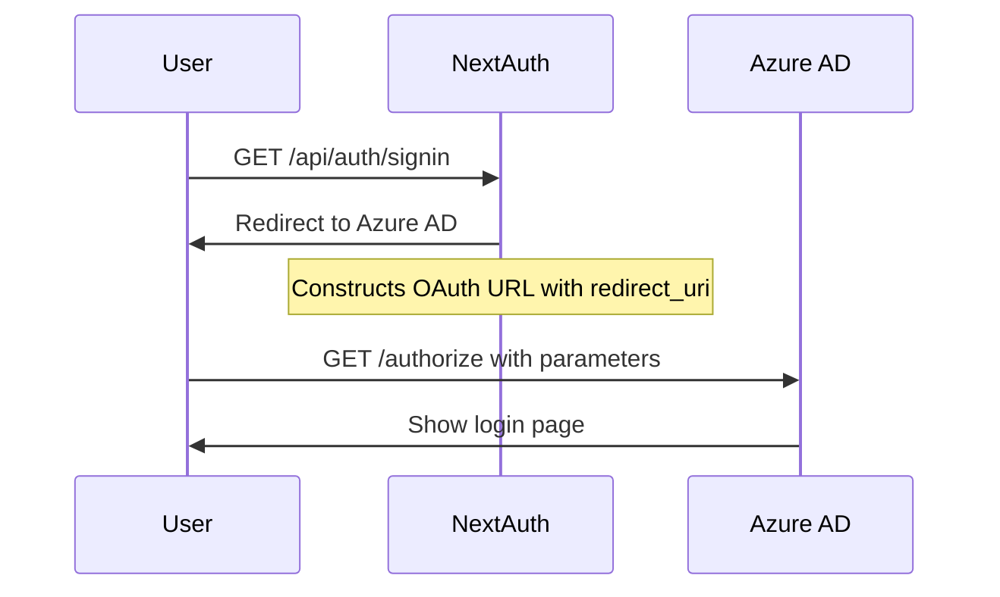

# NextAuth v4 SSO Communication Analysis

> **Deep dive into what NextAuth v4 sends to Azure AD SSO, why authentication works or fails, and the critical differences between Web and SPA configurations**

## 📋 Table of Contents

1. [Executive Summary](#executive-summary)
2. [What NextAuth v4 Sends to SSO](#what-nextauth-v4-sends-to-sso)
3. [The OAuth Flow in Detail](#the-oauth-flow-in-detail)
4. [Why VVG_TRUCKSCRAPE Works](#why-vvg_truckscrape-works)
5. [The SPA vs Web Platform Problem](#the-spa-vs-web-platform-problem)
6. [The NextAuth v4 BasePath Bug](#the-nextauth-v4-basepath-bug)
7. [Debugging Authentication Issues](#debugging-authentication-issues)
8. [Solutions and Workarounds](#solutions-and-workarounds)

## Executive Summary

This document reveals exactly what NextAuth v4 sends to Azure AD during authentication and explains:
- ✅ Why VVG_TRUCKSCRAPE authentication "just works" (by accident)
- ❌ Why it would fail with SPA configuration
- ❌ Why it breaks with basePath deployments
- 🔧 How the VVG_TEMPLATE workaround fixes the v4 bug

**Key Finding**: VVG_TRUCKSCRAPE works because it has NO basePath, accidentally avoiding the NextAuth v4 redirect_uri bug entirely.

## What NextAuth v4 Sends to SSO

### Step 1: Authorization Request

When a user initiates sign-in, NextAuth v4 constructs and redirects to this URL:

```http
GET https://login.microsoftonline.com/{tenant}/oauth2/v2.0/authorize?
  client_id={AZURE_AD_CLIENT_ID}
  &response_type=code
  &redirect_uri={COMPUTED_REDIRECT_URI}
  &response_mode=query
  &scope=openid%20profile%20email
  &state={CSRF_TOKEN_AND_CALLBACK}
  &code_challenge={PKCE_CHALLENGE}
  &code_challenge_method=S256
```

### Parameter Breakdown

| Parameter | Purpose | Example Value |
|-----------|---------|---------------|
| `client_id` | Azure AD app identifier | `a7f6d2c4-8b92-4e3f-9c1a-5d7e6f8a9b0c` |
| `response_type` | OAuth flow type | `code` (Authorization Code flow) |
| `redirect_uri` | **CRITICAL** - Where to send user after auth | `https://truckscrape.com/api/auth/callback/azure-ad` |
| `scope` | Permissions requested | `openid profile email` |
| `state` | CSRF token + original destination | Base64 encoded JSON |
| `code_challenge` | PKCE security challenge | `E9Melhoa2OwvFrEMTJguCHaoeK1t8URWbuGJSstw-cM` |

### The State Parameter Decoded

```javascript
// The state parameter contains:
{
  "csrfToken": "7d99fa72-1645-4232-896b-cc5e64073f74",
  "callbackUrl": "/dashboard"  // Where user wanted to go
}
```

## The OAuth Flow in Detail

### Phase 1: User Initiates Authentication



### Phase 2: Azure AD Authentication

1. User enters credentials
2. Azure AD validates credentials
3. Azure AD checks if `redirect_uri` matches registered URLs
4. If match → Continue
5. If no match → **AADSTS50011 ERROR**

### Phase 3: Authorization Code Return

```http
GET https://truckscrape.com/api/auth/callback/azure-ad?
  code=0.AXAAdi1oGr-zhUO50gQX9hkYZMTy9qeJkj9OAaTy...
  &state=eyJhbGciOiJIUzI1NiJ9...
  &session_state=7d3c5479-9b2e-4ea5-b7f0-6c8c635c0bb6
```

### Phase 4: Token Exchange

NextAuth makes a backend POST request:

```http
POST https://login.microsoftonline.com/{tenant}/oauth2/v2.0/token
Content-Type: application/x-www-form-urlencoded

grant_type=authorization_code
&code=0.AXAAdi1oGr-zhUO50gQX9hkYZMTy9qeJkj9OAaTy...
&redirect_uri=https://truckscrape.com/api/auth/callback/azure-ad
&client_id={AZURE_AD_CLIENT_ID}
&client_secret={AZURE_AD_CLIENT_SECRET}
&code_verifier={PKCE_VERIFIER}
```

**CRITICAL**: The `redirect_uri` must match EXACTLY in both requests!

## Why VVG_TRUCKSCRAPE Works

### The Accidental Success

VVG_TRUCKSCRAPE authentication works because:

```javascript
// vvg_truckscrape configuration
basePath: undefined  // NO basePath
NEXTAUTH_URL: "https://truckscrape.com"

// Manual redirect_uri in auth-options.ts:
redirect_uri: process.env.NEXTAUTH_URL + "/api/auth/callback/azure-ad"
// Result: "https://truckscrape.com/api/auth/callback/azure-ad"

// What NextAuth v4 would compute internally:
// baseUrl: "https://truckscrape.com"
// redirect_uri: "https://truckscrape.com/api/auth/callback/azure-ad"

// THEY MATCH! ✅
```

### Why It's "Accidental"

The manual `redirect_uri` configuration happens to produce the same result as NextAuth's internal calculation when there's NO basePath:

| Scenario | Manual Override | NextAuth Internal | Match? |
|----------|----------------|-------------------|---------|
| No basePath | `https://site.com/api/auth/callback/azure-ad` | `https://site.com/api/auth/callback/azure-ad` | ✅ YES |
| With basePath | `https://site.com/app/api/auth/callback/azure-ad` | `https://site.com/api/auth/callback/azure-ad` | ❌ NO |

## The SPA vs Web Platform Problem

### Why NextAuth CANNOT Work with SPA Configuration

**Azure AD Platform Types:**

| Feature | Web Application | Single Page Application (SPA) |
|---------|----------------|------------------------------|
| **Client Type** | Confidential (has secret) | Public (no secret) |
| **Client Secret** | ✅ Required | ❌ Not allowed |
| **OAuth Flow** | Authorization Code | Authorization Code + PKCE only |
| **Token Handling** | Server-side | Client-side JavaScript |
| **Redirect URI Validation** | Standard | Very strict |
| **NextAuth Compatible** | ✅ YES | ❌ NO |

### The Fundamental Incompatibility

```javascript
// NextAuth REQUIRES a client secret:
AzureADProvider({
  clientId: process.env.AZURE_AD_CLIENT_ID!,
  clientSecret: process.env.AZURE_AD_CLIENT_SECRET!, // REQUIRED!
  tenantId: process.env.AZURE_AD_TENANT_ID,
})

// But SPA apps in Azure AD:
// 1. Don't have client secrets
// 2. Are configured as "public clients"
// 3. Use PKCE-only flow
// 4. Expect client-side token handling
```

### SPA Error Messages

When Azure AD app is configured as SPA, you'll see:

```
AADSTS9002325: Proof Key for Code Exchange is required for cross-origin authorization code redemption.
```

Or:

```
AADSTS7000218: The request body must contain the following parameter: 'client_assertion' or 'client_secret'.
```

## The NextAuth v4 BasePath Bug

### How NextAuth v4 Computes redirect_uri

```javascript
// Simplified NextAuth v4 internal logic:
function getRedirectUri(provider) {
  // Gets base URL WITHOUT considering basePath
  const baseUrl = process.env.NEXTAUTH_URL || getBaseUrl();
  
  // For Azure AD provider:
  return `${baseUrl}/api/auth/callback/${provider.id}`;
}

// Problem: When basePath="/app"
// NEXTAUTH_URL = "https://site.com/app"
// But NextAuth strips the basePath!
// Result: "https://site.com/api/auth/callback/azure-ad" ❌
```

### The Bug in Action

**Scenario 1: No BasePath (VVG_TRUCKSCRAPE)**
```
Configuration:
- basePath: undefined
- NEXTAUTH_URL: "https://truckscrape.com"

NextAuth computes: "https://truckscrape.com/api/auth/callback/azure-ad" ✅
Manual override: "https://truckscrape.com/api/auth/callback/azure-ad" ✅
Result: WORKS (they match)
```

**Scenario 2: With BasePath (VVG_TEMPLATE without workaround)**
```
Configuration:
- basePath: "/template"
- NEXTAUTH_URL: "https://site.com/template"

NextAuth computes: "https://site.com/api/auth/callback/azure-ad" ❌
Expected by Azure: "https://site.com/template/api/auth/callback/azure-ad"
Result: FAILS (mismatch)
```

### The VVG_TEMPLATE Workaround

```javascript
// auth-nextauth-v4-workaround.ts
export function getAzureADConfiguration(config: AuthConfig): OAuthConfig<any> {
  return {
    ...baseConfig,
    authorization: {
      params: {
        scope: "openid profile email offline_access User.Read",
        // OVERRIDE the broken redirect_uri calculation:
        redirect_uri: config.NEXTAUTH_URL + "/api/auth/callback/azure-ad"
      }
    }
  };
}
```

## Debugging Authentication Issues

### 1. Check What's Being Sent

**Browser DevTools Method:**
1. Open Network tab
2. Initiate sign-in
3. Find request to `login.microsoftonline.com`
4. Check URL parameters, especially `redirect_uri`

**NextAuth Debug Mode:**
```javascript
// In auth-options.ts
export const authOptions: NextAuthOptions = {
  debug: true,
  logger: {
    error(code, metadata) {
      console.error('NextAuth Error:', code, metadata)
    },
    debug(code, metadata) {
      console.log('NextAuth Debug:', code, metadata)
    }
  }
}
```

### 2. Common Azure AD Error Messages

| Error Code | Meaning | Solution |
|------------|---------|----------|
| AADSTS50011 | Redirect URI mismatch | Check Azure AD registration matches exactly |
| AADSTS9002325 | SPA configuration issue | Change to Web platform type |
| AADSTS7000218 | Missing client secret | Ensure Web platform, not SPA |
| AADSTS700054 | Response_type not allowed | Check platform configuration |

### 3. Verification Checklist

```bash
✓ Azure AD app configured as "Web" platform (not SPA)
✓ Client secret exists and is not expired
✓ Redirect URIs registered in Azure AD match exactly
✓ NEXTAUTH_URL includes basePath if used
✓ Manual redirect_uri override in place for basePath deployments
```

## Solutions and Workarounds

### Solution 1: Fix Azure AD Configuration

1. **Remove SPA Platform:**
   ```
   Azure Portal → App Registration → Authentication
   → Delete "Single-page application" platform
   ```

2. **Add Web Platform:**
   ```
   → Add a platform → Web
   → Add redirect URI: https://your-site.com/api/auth/callback/azure-ad
   → Enable: ID tokens, Access tokens
   ```

3. **Generate Client Secret:**
   ```
   → Certificates & secrets → New client secret
   → Copy VALUE (not ID) to AZURE_AD_CLIENT_SECRET
   ```

### Solution 2: Handle BasePath (VVG_TEMPLATE Approach)

```javascript
// For basePath deployments, manually override redirect_uri:
AzureADProvider({
  clientId: process.env.AZURE_AD_CLIENT_ID!,
  clientSecret: process.env.AZURE_AD_CLIENT_SECRET!,
  tenantId: process.env.AZURE_AD_TENANT_ID,
  authorization: {
    params: {
      scope: "openid profile email offline_access User.Read",
      redirect_uri: process.env.NEXTAUTH_URL + "/api/auth/callback/azure-ad"
    }
  }
})
```

### Solution 3: Upgrade to NextAuth v5

```bash
# NextAuth v5 fixes the basePath bug
npm install next-auth@beta

# Remove manual redirect_uri overrides
# v5 handles basePath correctly
```

## Key Takeaways

1. **VVG_TRUCKSCRAPE works by accident** - no basePath means no bug exposure
2. **SPA configuration is incompatible** with NextAuth server-side flow
3. **NextAuth v4 has a basePath bug** that requires manual workarounds
4. **redirect_uri must match EXACTLY** between all OAuth steps
5. **Azure AD Web platform is required** for NextAuth applications

## Conclusion

Understanding what NextAuth v4 sends to SSO reveals why authentication can mysteriously work in one deployment (root domain) but fail in another (subdirectory). The combination of Azure AD platform type, basePath configuration, and NextAuth v4's redirect_uri bug creates a complex troubleshooting scenario that this analysis helps resolve.

For production deployments, always:
- Use Web platform type in Azure AD
- Include manual redirect_uri override for basePath deployments
- Consider upgrading to NextAuth v5 when stable

---

*Last updated: November 2024*  
*NextAuth v4 SSO Communication Analysis*