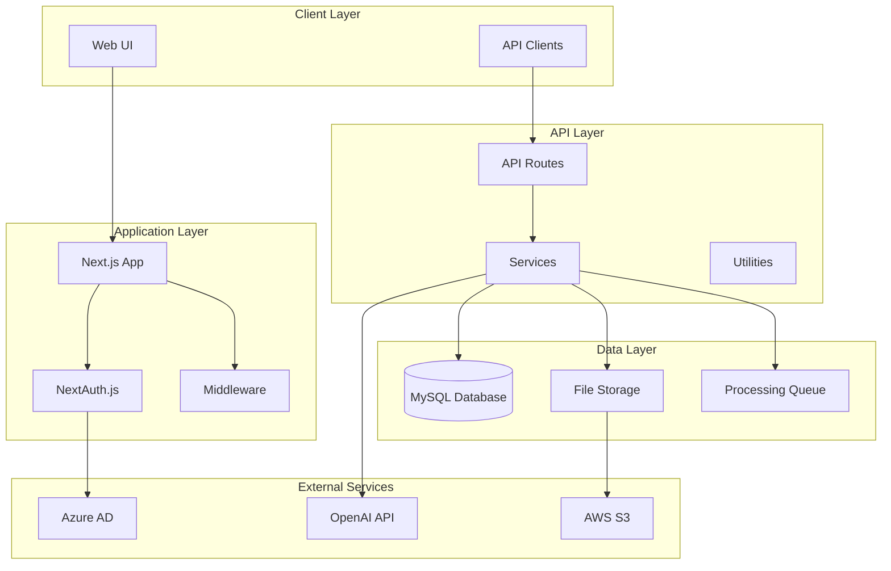

# Architecture Overview

System architecture and technical design of the Document Processing Template.

## 🏗️ High-Level Architecture

### System Components



### Technology Stack

#### Frontend
- **Next.js 14**: React framework with App Router
- **React 18**: UI library with server components
- **TypeScript**: Type-safe JavaScript
- **Tailwind CSS**: Utility-first CSS framework
- **shadcn/ui**: Modern component library
- **Framer Motion**: Animation library

#### Backend
- **Next.js API Routes**: Serverless API endpoints
- **NextAuth.js**: Authentication framework
- **MySQL**: Relational database
- **Node.js**: JavaScript runtime
- **Prisma/Raw SQL**: Database access

#### Infrastructure
- **Docker**: Containerization
- **NGINX**: Reverse proxy and load balancer
- **PM2**: Process manager
- **Winston**: Logging framework
- **AWS S3**: Object storage
- **Azure AD**: Identity provider

## 🧱 Application Architecture

### Layered Architecture

```
┌─────────────────────────────────────┐
│            Presentation Layer        │
│  • React Components                 │
│  • Pages & Layouts                  │
│  • Client-side State Management     │
└─────────────────────────────────────┘
┌─────────────────────────────────────┐
│             Service Layer           │
│  • API Routes                       │
│  • Business Logic                   │
│  • External API Integration         │
└─────────────────────────────────────┘
┌─────────────────────────────────────┐
│             Data Access Layer       │
│  • Database Repositories            │
│  • File Storage Abstraction         │
│  • Cache Management                 │
└─────────────────────────────────────┘
┌─────────────────────────────────────┐
│             Infrastructure          │
│  • Database (MySQL)                 │
│  • File Storage (S3/Local)          │
│  • External Services (Azure/OpenAI) │
└─────────────────────────────────────┘
```

### Directory Structure

```
app/                          # Next.js App Router
├── (auth)/                   # Authentication pages
├── (dashboard)/              # Protected dashboard pages
├── api/                      # API routes
│   ├── auth/                 # Authentication endpoints
│   ├── documents/            # Document management
│   ├── compare/              # Document comparison
│   └── health/               # Health check endpoints
├── globals.css               # Global styles
├── layout.tsx                # Root layout
└── page.tsx                  # Home page

components/                   # React components
├── ui/                       # Base UI components (shadcn/ui)
├── auth/                     # Authentication components
├── documents/                # Document-related components
└── layout/                   # Layout components

lib/                          # Utility libraries
├── auth-options.ts           # NextAuth configuration
├── auth-utils.ts             # Authentication utilities
├── config.ts                 # Configuration management
├── db.ts                     # Database connection
├── services/                 # Business logic services
├── storage/                  # Storage abstraction
├── template/                 # Template-specific modules
└── utils.ts                  # General utilities

types/                        # TypeScript definitions
├── next-auth.d.ts            # NextAuth type extensions
├── template/                 # Template-specific types
└── global.d.ts               # Global type definitions
```

## 🔧 Core Components

### Authentication System

```typescript
// Authentication Flow
┌─────────────┐    ┌─────────────┐    ┌─────────────┐
│   Browser   │    │  Next.js    │    │  Azure AD   │
│             │────│             │────│             │
│             │    │             │    │             │
└─────────────┘    └─────────────┘    └─────────────┘
       │                   │                   │
       │ 1. Login Request  │                   │
       │──────────────────▶│                   │
       │                   │ 2. Redirect to    │
       │                   │    Azure AD       │
       │                   │──────────────────▶│
       │                   │                   │
       │ 3. Azure AD Login │                   │
       │◀─────────────────────────────────────│
       │                   │                   │
       │ 4. Callback       │                   │
       │──────────────────▶│                   │
       │                   │ 5. Token Exchange │
       │                   │──────────────────▶│
       │                   │                   │
       │                   │ 6. User Info      │
       │                   │◀──────────────────│
       │                   │                   │
       │ 7. Session Cookie │                   │
       │◀──────────────────│                   │
```

### Document Processing Pipeline

```typescript
// Document Upload & Processing Flow
┌─────────────┐    ┌─────────────┐    ┌─────────────┐    ┌─────────────┐
│   Upload    │    │ Validation  │    │   Storage   │    │ Processing  │
│             │────│             │────│             │────│             │
│             │    │             │    │             │    │             │
└─────────────┘    └─────────────┘    └─────────────┘    └─────────────┘
       │                   │                   │                   │
       │ File Selected     │                   │                   │
       │                   │ Size/Type Check   │                   │
       │                   │                   │ Upload to S3      │
       │                   │                   │                   │ Extract Text
       │                   │                   │                   │ Generate Preview
       │                   │                   │                   │ Update Database
       │                   │                   │                   │
       ▼                   ▼                   ▼                   ▼
┌─────────────────────────────────────────────────────────────────────┐
│                      Database Record                                │
│  • File metadata     • Storage location     • Processing status     │
│  • Extracted text    • User ownership       • Creation timestamp    │
└─────────────────────────────────────────────────────────────────────┘
```

### Comparison Engine

```typescript
// Document Comparison Architecture
┌─────────────┐    ┌─────────────┐    ┌─────────────┐
│  Document A │    │ Comparison  │    │  Document B │
│             │────│   Engine    │────│             │
│             │    │             │    │             │
└─────────────┘    └─────────────┘    └─────────────┘
       │                   │                   │
       │ Text Content      │                   │ Text Content
       │                   │                   │
       ▼                   ▼                   ▼
┌─────────────────────────────────────────────────────┐
│              AI Processing (OpenAI)                  │
│  • Semantic Analysis    • Difference Detection      │
│  • Risk Assessment      • Recommendation Generation │
└─────────────────────────────────────────────────────┘
       │
       ▼
┌─────────────────────────────────────────────────────┐
│                Comparison Results                    │
│  • Similarity Score     • Key Differences           │
│  • Risk Level          • Actionable Recommendations │
└─────────────────────────────────────────────────────┘
```

## 🗄️ Database Design

### Entity Relationship Diagram

```sql
┌─────────────────┐    ┌─────────────────┐    ┌─────────────────┐
│    documents    │    │   comparisons   │    │  comparison_    │
│                 │    │                 │    │    results      │
│ • id (PK)       │    │ • id (PK)       │    │ • id (PK)       │
│ • filename      │◄───┤ • document1_id  │───►│ • comparison_id │
│ • user_email    │    │ • document2_id  │    │ • section_name  │
│ • file_size     │    │ • user_email    │    │ • similarity    │
│ • mime_type     │    │ • status        │    │ • differences   │
│ • storage_path  │    │ • results       │    │ • risk_level    │
│ • is_standard   │    │ • created_at    │    │ • created_at    │
│ • extracted_text│    │ • completed_at  │    └─────────────────┘
│ • status        │    └─────────────────┘
│ • created_at    │
│ • updated_at    │
└─────────────────┘
```

### Key Tables

#### Documents Table
```sql
CREATE TABLE documents (
  id VARCHAR(255) PRIMARY KEY,
  filename VARCHAR(255) NOT NULL,
  original_name VARCHAR(255) NOT NULL,
  user_email VARCHAR(255) NOT NULL,
  file_size INT NOT NULL,
  mime_type VARCHAR(100) NOT NULL,
  storage_path VARCHAR(500) NOT NULL,
  is_standard BOOLEAN DEFAULT FALSE,
  extracted_text TEXT,
  metadata JSON,
  status ENUM('uploading', 'processing', 'processed', 'failed') DEFAULT 'uploading',
  created_at TIMESTAMP DEFAULT CURRENT_TIMESTAMP,
  updated_at TIMESTAMP DEFAULT CURRENT_TIMESTAMP ON UPDATE CURRENT_TIMESTAMP,
  
  INDEX idx_user_email (user_email),
  INDEX idx_created_at (created_at),
  INDEX idx_status (status),
  INDEX idx_is_standard (is_standard)
);
```

#### Comparisons Table
```sql
CREATE TABLE comparisons (
  id VARCHAR(255) PRIMARY KEY,
  document1_id VARCHAR(255) NOT NULL,
  document2_id VARCHAR(255) NOT NULL,
  user_email VARCHAR(255) NOT NULL,
  comparison_type ENUM('simple', 'detailed', 'legal') DEFAULT 'detailed',
  status ENUM('pending', 'processing', 'completed', 'failed') DEFAULT 'pending',
  results JSON,
  error_message TEXT,
  created_at TIMESTAMP DEFAULT CURRENT_TIMESTAMP,
  completed_at TIMESTAMP NULL,
  
  FOREIGN KEY (document1_id) REFERENCES documents(id) ON DELETE CASCADE,
  FOREIGN KEY (document2_id) REFERENCES documents(id) ON DELETE CASCADE,
  INDEX idx_user_email (user_email),
  INDEX idx_status (status),
  INDEX idx_created_at (created_at)
);
```

## 🔒 Security Architecture

### Security Layers

```
┌─────────────────────────────────────────────────────┐
│                  Transport Layer                     │
│  • HTTPS/TLS 1.3        • HSTS Headers              │
│  • Certificate Pinning  • Perfect Forward Secrecy   │
└─────────────────────────────────────────────────────┘
┌─────────────────────────────────────────────────────┐
│                Application Layer                     │
│  • CSRF Protection      • XSS Prevention            │
│  • Input Validation     • Output Encoding           │
│  • Rate Limiting        • Security Headers          │
└─────────────────────────────────────────────────────┘
┌─────────────────────────────────────────────────────┐
│               Authentication Layer                   │
│  • Azure AD OAuth 2.0   • JWT Token Validation      │
│  • Session Management   • Multi-Factor Auth         │
└─────────────────────────────────────────────────────┘
┌─────────────────────────────────────────────────────┐
│                Authorization Layer                   │
│  • Document Ownership   • API Key Validation        │
│  • Resource Access      • Admin Permissions         │
└─────────────────────────────────────────────────────┘
┌─────────────────────────────────────────────────────┘
│                    Data Layer                       │
│  • Database Encryption  • File Encryption           │
│  • Access Logging       • Audit Trails              │
└─────────────────────────────────────────────────────┘
```

### Authentication Flow

1. **User Authentication**: Azure AD OAuth 2.0
2. **Session Management**: JWT tokens with secure cookies
3. **API Authentication**: Bearer tokens or session validation
4. **Resource Authorization**: Document ownership validation

### Data Protection

- **At Rest**: Database encryption, S3 server-side encryption
- **In Transit**: HTTPS, secure API communications
- **In Processing**: Memory encryption, secure temporary storage

## 📈 Performance Architecture

### Caching Strategy

```
┌─────────────────┐    ┌─────────────────┐    ┌─────────────────┐
│   Browser       │    │   CDN/NGINX     │    │   Application   │
│   Cache         │    │   Cache         │    │   Cache         │
│                 │    │                 │    │                 │
│ • Static Assets │    │ • Static Files  │    │ • API Responses │
│ • API Responses │    │ • Compressed    │    │ • Database      │
│ (short TTL)     │    │   Assets        │    │   Queries       │
└─────────────────┘    └─────────────────┘    └─────────────────┘
```

### Optimization Techniques

1. **Static Asset Optimization**
   - Image compression and optimization
   - JavaScript bundling and minification
   - CSS optimization and purging

2. **Database Optimization**
   - Connection pooling
   - Query optimization
   - Index strategy

3. **API Optimization**
   - Response caching
   - Pagination
   - Rate limiting

## 🔄 Deployment Architecture

### Container Architecture

```dockerfile
# Multi-stage build for optimization
FROM node:18-alpine AS builder
# Build stage - compile TypeScript, bundle assets

FROM node:18-alpine AS runner  
# Runtime stage - minimal image with production dependencies
```

### Infrastructure Components

```
┌─────────────────┐    ┌─────────────────┐    ┌─────────────────┐
│   Load Balancer │    │   Application   │    │    Database     │
│     (NGINX)     │────│   Containers    │────│    (MySQL)      │
│                 │    │                 │    │                 │
│ • SSL Term.     │    │ • Next.js App   │    │ • Primary DB    │
│ • Rate Limit    │    │ • PM2 Process   │    │ • Read Replicas │
│ • Health Check  │    │ • Auto-scaling  │    │ • Backups       │
└─────────────────┘    └─────────────────┘    └─────────────────┘
```

### Monitoring & Observability

```
┌─────────────────────────────────────────────────────┐
│                  Monitoring Stack                   │
│                                                     │
│  ┌─────────────┐  ┌─────────────┐  ┌─────────────┐  │
│  │  Logging    │  │  Metrics    │  │   Tracing   │  │
│  │ (Winston)   │  │(Prometheus) │  │  (OpenTel.) │  │
│  └─────────────┘  └─────────────┘  └─────────────┘  │
│                                                     │
│  ┌─────────────┐  ┌─────────────┐  ┌─────────────┐  │
│  │   Health    │  │   Alerts    │  │ Dashboards  │  │
│  │   Checks    │  │  (Custom)   │  │  (Grafana)  │  │
│  └─────────────┘  └─────────────┘  └─────────────┘  │
└─────────────────────────────────────────────────────┘
```

## 🔧 Configuration Management

### Environment-Based Configuration

```typescript
// Configuration hierarchy
{
  base: '.env',                    // Default values
  environment: '.env.production',  // Environment overrides
  local: '.env.local',            // Secrets and local overrides
  runtime: 'process.env'          // Runtime environment variables
}
```

### Feature Flags

```typescript
interface FeatureFlags {
  enableAIComparison: boolean;
  enableFileUpload: boolean;
  enableEmailNotifications: boolean;
  enableAdvancedAnalytics: boolean;
  maintenanceMode: boolean;
}
```

## 📊 Data Flow Architecture

### Request/Response Flow

```
Client Request
     │
     ▼
┌─────────────┐
│ Middleware  │ ← Authentication, Rate Limiting, Logging
└─────────────┘
     │
     ▼
┌─────────────┐
│ API Route   │ ← Route handling, input validation
└─────────────┘
     │
     ▼
┌─────────────┐
│ Service     │ ← Business logic, external API calls
└─────────────┘
     │
     ▼
┌─────────────┐
│ Repository  │ ← Data access, database operations
└─────────────┘
     │
     ▼
┌─────────────┐
│ Database    │ ← Data persistence
└─────────────┘
```

### Event Flow

```
User Action → Frontend → API → Service → Database
                                  │
                                  ▼
                           External Services
                           (Azure AD, OpenAI, S3)
                                  │
                                  ▼
                           Background Jobs
                           (Text extraction, etc.)
```

## 🚀 Scalability Considerations

### Horizontal Scaling

- **Application**: Multiple container instances behind load balancer
- **Database**: Read replicas, connection pooling
- **Storage**: Distributed object storage (S3)
- **Processing**: Background job queues

### Vertical Scaling

- **CPU**: Optimize compute-intensive operations
- **Memory**: Efficient memory usage, garbage collection
- **I/O**: Database indexing, file system optimization

### Performance Bottlenecks

1. **Database Queries**: Use indexes, optimize joins
2. **File Processing**: Background jobs, streaming
3. **API Responses**: Caching, pagination
4. **External APIs**: Rate limiting, retries

---

**Next**: [Database Schema](database.md) | [Authentication](authentication.md)