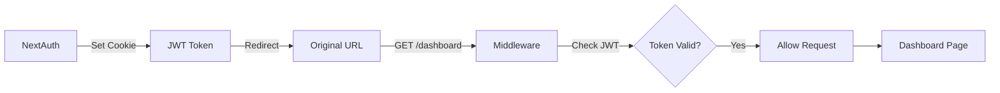

# VVG TruckScrape Authentication & Middleware Architecture

> **Complete analysis of authentication flow, middleware execution, and security implementation in vvg_truckscrape**

## 📋 Table of Contents

1. [Overview](#overview)
2. [Architecture Components](#architecture-components)
3. [Middleware Configuration](#middleware-configuration)
4. [Authentication Flow - Step by Step](#authentication-flow---step-by-step)
5. [Protected Route Access](#protected-route-access)
6. [API Route Protection](#api-route-protection)
7. [Session Management](#session-management)
8. [Sign-Out Flow](#sign-out-flow)
9. [Security Analysis](#security-analysis)
10. [Comparison with VVG Template](#comparison-with-vvg-template)

## Overview

VVG TruckScrape implements a **NextAuth.js v4** authentication system with **Azure Active Directory** as the identity provider. The system uses JWT-based sessions with middleware-level route protection.

### Key Features
- 🔐 Azure AD Single Sign-On (SSO)
- 🛡️ Middleware-based route protection
- 🎫 JWT session tokens (30-day expiration)
- 🔄 Automatic authentication redirects
- 📊 Session data enrichment

## Architecture Components

### 1. **Core Files**
```
├── middleware.ts              # Route protection middleware
├── lib/
│   ├── auth-options.ts       # NextAuth configuration
│   └── auth-utils.ts         # Authentication utilities
├── app/
│   ├── api/auth/[...nextauth]/route.ts  # NextAuth API routes
│   ├── sign-in/page.tsx      # Sign-in page
│   ├── auth/signout/page.tsx # Sign-out page
│   └── providers.tsx         # SessionProvider wrapper
```

### 2. **Environment Variables**
```bash
# Azure AD Configuration
AZURE_AD_CLIENT_ID=<your-client-id>
AZURE_AD_CLIENT_SECRET=<your-client-secret>
AZURE_AD_TENANT_ID=<your-tenant-id>

# NextAuth Configuration
NEXTAUTH_URL=https://your-app.com
NEXTAUTH_SECRET=<your-secret>
```

## Middleware Configuration

### Implementation (`middleware.ts`)
```typescript
import { withAuth } from "next-auth/middleware";
import { NextResponse } from "next/server";

export default withAuth(
  function middleware(req) {
    // Custom middleware logic (currently pass-through)
    return NextResponse.next();
  },
  {
    callbacks: {
      authorized: ({ token }) => !!token,  // Simple token existence check
    },
    pages: {
      signIn: "/sign-in",  // Redirect destination for unauthenticated users
    },
  }
);

// Protected route patterns
export const config = {
  matcher: [
    "/dashboard/:path*",
    "/api/:path*", 
    "/((?!api/auth|_next/static|_next/image|favicon.ico|sign-in|auth).*)"
  ],
};
```

### Route Protection Strategy
- **Default**: All routes protected except explicitly excluded
- **Excluded**: Authentication routes, static assets, sign-in page
- **Protected**: Dashboard, API endpoints, and general application routes

## Authentication Flow - Step by Step

### Phase 1: Initial Request (Unauthenticated)
```mermaid
graph LR
    A[User] -->|GET /dashboard| B[Next.js Server]
    B --> C[Middleware]
    C -->|Check JWT Cookie| D{Token Exists?}
    D -->|No| E[Redirect to /sign-in]
    E -->|with callbackUrl| F[/sign-in?callbackUrl=/dashboard]
```

**Code Flow:**
1. User requests: `https://app.com/dashboard`
2. Middleware intercepts via matcher pattern
3. `withAuth` checks for `next-auth.session-token` cookie
4. No token found → `authorized()` returns `false`
5. Redirect: `/sign-in?callbackUrl=/dashboard`

### Phase 2: Sign-In Page
```typescript
// app/sign-in/page.tsx
"use client";
import { signIn } from "next-auth/react";
import { useSearchParams } from "next/navigation";
import { useEffect } from "react";

export default function SignInPage() {
  const searchParams = useSearchParams();
  
  useEffect(() => {
    const callbackUrl = searchParams.get("callbackUrl") || "/dashboard";
    signIn("azure-ad", { callbackUrl });
  }, [searchParams]);

  return (
    <div className="flex items-center justify-center min-h-screen">
      <div className="text-center">
        <h2 className="text-2xl font-semibold mb-2">Signing you in...</h2>
        <p className="text-gray-600">Redirecting to Microsoft login</p>
      </div>
    </div>
  );
}
```

**Execution:**
1. Component mounts and extracts `callbackUrl`
2. Immediately calls `signIn("azure-ad", { callbackUrl })`
3. User sees loading state briefly
4. Redirect to Microsoft OAuth URL

### Phase 3: Azure AD Authentication
```
OAuth 2.0 Authorization URL:
https://login.microsoftonline.com/{tenant}/oauth2/v2.0/authorize?
  client_id={AZURE_AD_CLIENT_ID}
  &response_type=code
  &redirect_uri={NEXTAUTH_URL}/api/auth/callback/azure-ad
  &scope=openid profile email
  &state={csrf-token}
```

**Azure AD Process:**
1. User enters Microsoft credentials
2. Consent to requested scopes (if first time)
3. Azure AD validates credentials
4. Generates authorization code
5. Redirects back to callback URL

### Phase 4: NextAuth Callback Processing

#### Auth Route Handler (`app/api/auth/[...nextauth]/route.ts`)
```typescript
import NextAuth from "next-auth";
import { authOptions } from "@/lib/auth-options";

const handler = NextAuth(authOptions);
export { handler as GET, handler as POST };
```

#### Callback Configuration (`lib/auth-options.ts`)
```typescript
export const authOptions: NextAuthOptions = {
  providers: [
    AzureADProvider({
      clientId: process.env.AZURE_AD_CLIENT_ID!,
      clientSecret: process.env.AZURE_AD_CLIENT_SECRET!,
      tenantId: process.env.AZURE_AD_TENANT_ID,
      authorization: {
        params: {
          scope: "openid profile email",
          redirect_uri: process.env.NEXTAUTH_URL + "/api/auth/callback/azure-ad"
        }
      }
    }),
  ],
  callbacks: {
    async jwt({ token, account, profile }) {
      // First sign in - enrich token with Azure AD data
      if (account && profile) {
        token.accessToken = account.access_token;
        token.id = profile.sub || (profile as any).oid || profile.email;
      }
      return token;
    },
    async session({ session, token }) {
      // Add custom fields to session
      if (session.user) {
        session.user.id = token.id as string;
        session.accessToken = token.accessToken as string;
      }
      return session;
    },
  },
  session: {
    strategy: "jwt",
    maxAge: 30 * 24 * 60 * 60, // 30 days
  },
};
```

**Processing Steps:**
1. Exchange authorization code for tokens
2. JWT callback enriches token with:
   - Access token from Azure AD
   - User ID (prioritizes `sub`, then `oid`, then `email`)
3. Session callback adds to session object:
   - User ID
   - Access token
4. JWT cookie set with 30-day expiration

### Phase 5: Authenticated Redirect


**Final Steps:**
1. NextAuth sets `next-auth.session-token` cookie
2. Redirects to original `callbackUrl` (`/dashboard`)
3. Middleware runs again on `/dashboard`
4. `withAuth` finds valid JWT token
5. `authorized()` returns `true`
6. Request proceeds to dashboard page

## Protected Route Access

### Client-Side Protection
```typescript
// In React components
import { useSession } from "next-auth/react";
import { redirect } from "next/navigation";

export default function ProtectedPage() {
  const { data: session, status } = useSession();

  if (status === "loading") {
    return <div>Loading...</div>;
  }

  if (!session) {
    redirect("/sign-in");
  }

  return (
    <div>
      <h1>Welcome, {session.user?.name}!</h1>
      <p>User ID: {session.user?.id}</p>
    </div>
  );
}
```

### Server-Side Protection
```typescript
// lib/auth-utils.ts
import { getServerSession } from "next-auth";
import { authOptions } from "./auth-options";
import { redirect } from "next/navigation";

export async function requireAuth() {
  const session = await getServerSession(authOptions);
  
  if (!session) {
    redirect("/sign-in");
  }
  
  return session;
}

// Usage in Server Components
export default async function ServerProtectedPage() {
  const session = await requireAuth();
  
  return <h1>Hello {session.user.email}</h1>;
}
```

## API Route Protection

### Protected API Example
```typescript
// app/api/protected-example/route.ts
import { NextResponse } from "next/server";
import { getServerSession } from "next-auth";
import { authOptions } from "@/lib/auth-options";

export async function GET() {
  const session = await getServerSession(authOptions);

  if (!session) {
    return NextResponse.json(
      { error: "Authentication required" },
      { status: 401 }
    );
  }

  return NextResponse.json({
    message: "This is protected data",
    user: session.user
  });
}
```

### API Request Flow
```
1. Client: GET /api/trucks
2. Middleware: Checks JWT token
3. If valid → Route handler executes
4. If invalid → 401 Unauthorized (never reaches handler)
5. Route handler can access session via getServerSession()
```

## Session Management

### Session Data Structure
```typescript
interface Session {
  user: {
    name?: string | null;
    email?: string | null;
    image?: string | null;
    id: string;  // Custom field added in callback
  };
  accessToken: string;  // Custom field for Azure AD token
  expires: string;      // ISO date string
}
```

### Session Access Patterns
```typescript
// Client Component
const { data: session } = useSession();

// Server Component
const session = await getServerSession(authOptions);

// API Route
const session = await getServerSession(authOptions);
```

## Sign-Out Flow

### Sign-Out Implementation
```typescript
// app/auth/signout/page.tsx
"use client";
import { signOut } from "next-auth/react";
import { useEffect } from "react";

export default function SignOutPage() {
  useEffect(() => {
    signOut({ callbackUrl: "/" });
  }, []);

  return (
    <div className="flex items-center justify-center min-h-screen">
      <p>Signing out...</p>
    </div>
  );
}
```

### Sign-Out Process
1. User navigates to `/auth/signout`
2. `signOut()` function called automatically
3. NextAuth clears JWT cookie
4. User redirected to home page (`/`)
5. All subsequent requests are unauthenticated

## Security Analysis

### Strengths
1. **JWT Security**: Tokens stored as httpOnly cookies
2. **CSRF Protection**: Built into NextAuth
3. **No Client Secrets**: OAuth flow keeps secrets server-side
4. **Automatic Expiration**: 30-day token lifetime
5. **Middleware Protection**: Routes secured at edge

### Considerations
1. **No Refresh Tokens**: Users must re-authenticate after 30 days
2. **Token Size**: JWT can grow large with custom claims
3. **Revocation**: No built-in token revocation mechanism
4. **Role-Based Access**: Basic implementation, needs enhancement

### Security Headers
```typescript
// Currently minimal - could be enhanced
export default withAuth(
  function middleware(req) {
    // Could add security headers here
    const response = NextResponse.next();
    response.headers.set('X-Frame-Options', 'DENY');
    response.headers.set('X-Content-Type-Options', 'nosniff');
    return response;
  }
);
```

## Comparison with VVG Template

### Authentication Differences

| Feature | VVG TruckScrape | VVG Template |
|---------|-----------------|--------------|
| **NextAuth Version** | v4.24.11 | v4.24.11 with workaround |
| **Provider Config** | Basic Azure AD | Enhanced with offline_access |
| **Redirect Handling** | Manual redirect_uri | v4 workaround module |
| **Logging** | Debug mode only | Winston integration |
| **Event Tracking** | None | Sign-in/out events logged |
| **BasePath Support** | None | Full basePath support |
| **Scopes** | `openid profile email` | `openid profile email offline_access User.Read` |

### Middleware Differences

| Feature | VVG TruckScrape | VVG Template |
|---------|-----------------|--------------|
| **Protection Strategy** | Blacklist (protect all) | Configurable |
| **Request Logging** | None | Full request logging |
| **Security Headers** | None | Comprehensive headers |
| **Request ID** | None | UUID tracking |
| **Performance Monitoring** | None | Request timing |
| **Development Bypass** | None | X-Dev-Bypass header |

### Code Comparison

**TruckScrape Middleware (Simple):**
```typescript
export default withAuth(
  function middleware(req) {
    return NextResponse.next();
  },
  {
    callbacks: {
      authorized: ({ token }) => !!token,
    },
  }
);
```

**Template Middleware (Enhanced):**
```typescript
export default async function middleware(request: NextRequest) {
  const requestId = crypto.randomUUID();
  const start = Date.now();
  
  // Logging
  logger.info(`→ ${request.method} ${pathname}`, { requestId });
  
  // Security headers
  const headers = new Headers(request.headers);
  headers.set('X-Request-Id', requestId);
  headers.set('X-Frame-Options', 'DENY');
  
  // Auth check
  if (isProtectedRoute && !session) {
    return redirectToSignIn();
  }
  
  // Continue with timing
  const response = NextResponse.next({ headers });
  const duration = Date.now() - start;
  logger.info(`← ${request.method} ${pathname} ${duration}ms`);
  
  return response;
}
```

### Migration Path

To upgrade TruckScrape to Template standards:

1. **Add Logging**: Integrate Winston for auth events
2. **Enhance Middleware**: Add security headers and request tracking
3. **BasePath Support**: Implement for flexible deployment
4. **Extended Scopes**: Add offline_access for better token management
5. **Event Handlers**: Track user sign-in/out events
6. **Error Handling**: Add comprehensive error logging
7. **Performance Monitoring**: Add request timing

---

*Last updated: November 2024*  
*VVG TruckScrape Authentication Architecture Documentation*