# PHASE 2 TESTING & INFRASTRUCTURE DECISION TREE

## 🎯 GIT WORKFLOW STRATEGY: PROGRESSIVE INTEGRATION WITH SAFETY NET

### **RECOMMENDED APPROACH: Parallel Branch Development**

**Don't merge to main yet.** Use a three-branch strategy for maximum safety and productivity:

#### **Branch Structure:**
1. **`main`** - Co-worker's validated baseline (untouched safety net)
2. **`feature/dry-refactoring-test`** - Completed refactoring (frozen for testing)  
3. **`develop/nda-features-refactored`** - Active development (from refactored base)

#### **Immediate Setup:**
```bash
# Create development branch from refactored state
git checkout feature/dry-refactoring-test
git checkout -b develop/nda-features-refactored

# Set up development tracking
echo "# Development Progress Log" > DEV_LOG.md
echo "Base: DRY Refactored Codebase" >> DEV_LOG.md
echo "Started: $(date)" >> DEV_LOG.md

# Continue development with refactoring benefits
git push origin develop/nda-features-refactored
```

#### **Daily Development Workflow:**
```bash
# Work on new features with refactored foundation
git checkout develop/nda-features-refactored

# Use commit prefixes for easy categorization
git commit -m "FEATURE: Add document comparison API"
git commit -m "BUGFIX: Fix file upload edge case"
git commit -m "REFACTOR-DEP: Update to use withAuth wrapper"
```

#### **Benefits:**
- ✅ **Immediate productivity** - Get refactoring benefits now
- ✅ **Zero risk to main** - Baseline always available
- ✅ **Flexible rollback** - Can salvage features regardless of Phase 2
- ✅ **Clear separation** - Easy to distinguish new work from refactoring

### **Git Workflow Visualization:**

```mermaid
gitGraph
    commit id: "Initial Commit"
    commit id: "Co-worker Baseline"
    commit id: "26a1b28 (VALIDATED)"
    
    branch feature/dry-refactoring-test
    checkout feature/dry-refactoring-test
    commit id: "Remove duplicate files"
    commit id: "Add withAuth wrapper"
    commit id: "Add ApiErrors utilities"
    commit id: "Add FileValidation"
    commit id: "DRY Refactoring Complete"
    commit id: "Phase 1 Testing: PASSED"
    
    branch develop/nda-features-refactored
    checkout develop/nda-features-refactored
    commit id: "FEATURE: Document comparison"
    commit id: "FEATURE: Enhanced upload UI"
    commit id: "BUGFIX: File validation edge case"
    commit id: "REFACTOR-DEP: Use withAuth"
    commit id: "FEATURE: Export functionality"
    
    checkout main
    commit id: "Emergency fix (if needed)"
    
    %% Phase 2 Decision Point
    checkout feature/dry-refactoring-test
    commit id: "Phase 2 Testing"
    
    %% SUCCESS PATH
    checkout main
    merge feature/dry-refactoring-test
    commit id: "✅ Refactoring Merged"
    
    checkout develop/nda-features-refactored
    merge main
    commit id: "Rebase on refactored main"
    
    checkout main
    merge develop/nda-features-refactored
    commit id: "🚀 Production Ready"
    
    %% FALLBACK PATH (alternative timeline)
    checkout main
    branch develop/nda-features-baseline
    checkout develop/nda-features-baseline
    commit id: "❌ Cherry-pick FEATURE commits"
    commit id: "Port REFACTOR-DEP manually"
    commit id: "Add safe 15% improvements"
    commit id: "🛡️ Baseline + Features"
```



*Note: See `git-workflow-strategy.svg` for a visual representation of this workflow.*

---

## 🎯 PHASE 2: INFRASTRUCTURE VALIDATION PROTOCOL

### **PREREQUISITES FOR PHASE 2 TESTING**
- [ ] EC2 instance access granted
- [ ] SSM tunnel established to RDS MySQL
- [ ] AWS S3 bucket configured and accessible
- [ ] Azure AD tenant credentials provided
- [ ] OpenAI API key configured

### **PHASE 2A: DATABASE INFRASTRUCTURE**

#### **2A.1: Database Connection Validation**
```bash
# Test SSM tunnel
aws ssm start-session --target i-07fba3edeb2e54729 \
  --document-name AWS-StartPortForwardingSessionToRemoteHost \
  --parameters host="vtcawsinnovationmysql01-cluster.cluster-c1hfshlb6czo.us-west-2.rds.amazonaws.com",portNumber="3306",localPortNumber="10003"

# Verify connection
curl http://localhost:3000/api/db-health
```

**SUCCESS CRITERIA**: Returns database connection successful
**FAILURE ACTION**: Rollback to in-memory mode immediately

#### **2A.2: Database Migration Execution**
```bash
# Set database creation permission
export DB_CREATE_ACCESS=true

# Run migration
curl -X POST http://localhost:3000/api/migrate-db

# Verify tables created
curl http://localhost:3000/api/debug-db
```

**SUCCESS CRITERIA**: All NDA tables created without errors
**FAILURE ACTION**: Reset DB_CREATE_ACCESS=false, continue with in-memory

#### **2A.3: Database Abstraction Layer Validation**
```bash
# Test document creation in MySQL
curl -X POST http://localhost:3000/api/seed-dev

# Verify data persists in MySQL
curl http://localhost:3000/api/documents

# Test database operations
curl -X POST http://localhost:3000/api/test-crud
```

**SUCCESS CRITERIA**: All CRUD operations work with MySQL
**FAILURE ACTION**: Immediate rollback to commit 26a1b28

### **PHASE 2B: STORAGE INFRASTRUCTURE**

#### **2B.1: S3 Configuration Validation**
```bash
# Set S3 environment variables
export STORAGE_PROVIDER=s3
export S3_ACCESS=true

# Test S3 connection
curl http://localhost:3000/api/storage-health
```

**SUCCESS CRITERIA**: S3 bucket accessible, credentials valid
**FAILURE ACTION**: Fallback to local storage, continue testing

#### **2B.2: S3 Storage Abstraction Validation**
```bash
# Test file upload to S3
curl -X POST -F "file=@documents/vvg/test.pdf" http://localhost:3000/api/upload

# Test signed URL generation
curl http://localhost:3000/api/documents/1/download

# Verify S3 object existence
aws s3 ls s3://vvg-cloud-storage/nda-analyzer/
```

**SUCCESS CRITERIA**: Files upload to S3, signed URLs work
**FAILURE ACTION**: Immediate storage layer rollback

### **PHASE 2C: AUTHENTICATION INFRASTRUCTURE**

#### **2C.1: Azure AD Configuration**
```bash
# Set Azure AD environment variables
export AZURE_AD_CLIENT_ID=your-client-id
export AZURE_AD_CLIENT_SECRET=your-client-secret
export AZURE_AD_TENANT_ID=your-tenant-id

# Test authentication endpoints
curl http://localhost:3000/api/auth/signin
```

**SUCCESS CRITERIA**: Azure AD login redirect works
**FAILURE ACTION**: Continue with development auth, note limitation

#### **2C.2: Real User Session Testing**
```bash
# Manual test: Complete Azure AD login flow
# Verify session creation
curl -H "Cookie: next-auth.session-token=..." http://localhost:3000/api/documents
```

**SUCCESS CRITERIA**: Real user sessions work with withAuth middleware
**FAILURE ACTION**: Document auth limitation, proceed with testing

### **PHASE 2D: AI PROCESSING INFRASTRUCTURE**

#### **2D.1: OpenAI API Configuration**
```bash
# Set OpenAI environment variable
export OPENAI_API_KEY=your-openai-key

# Test AI integration
curl -X POST -H "Content-Type: application/json" \
  -d '{"standardDocId":1,"thirdPartyDocId":2}' \
  http://localhost:3000/api/compare
```

**SUCCESS CRITERIA**: Real AI comparison results returned
**FAILURE ACTION**: Continue with mock comparisons

## 🚨 DECISION TREE FOR PHASE 2 FAILURES

### **SCENARIO A: Database Failure (2A.X fails)**
```bash
# IMMEDIATE ROLLBACK
git checkout main
git reset --hard 26a1b28

# PRESERVE SAFE IMPROVEMENTS
git cherry-pick fa45bbe  # Document APIs
git cherry-pick 3ab4d95  # File uploads
git checkout feature/dry-refactoring-test -- lib/utils.ts
git add lib/utils.ts
git commit -m "Keep FileValidation utilities only"

# RESULT: 15% improvements retained, 85% template changes discarded
```

### **SCENARIO B: Storage Failure (2B.X fails)**
```bash
# PARTIAL ROLLBACK - Keep database improvements
git checkout feature/dry-refactoring-test
git revert [storage-related-commits]
git commit -m "Revert storage abstraction, keep DB improvements"

# RESULT: Database improvements kept, storage changes reverted
```

### **SCENARIO C: Authentication Failure (2C.X fails)**
```bash
# AUTHENTICATION ROLLBACK
git checkout feature/dry-refactoring-test
git checkout 26a1b28 -- lib/auth-utils.ts
git checkout 26a1b28 -- middleware.ts
git commit -m "Revert auth middleware changes"

# RESULT: Core DRY improvements kept, auth changes reverted
```

### **SCENARIO D: All Phase 2 Passes ✅**
```bash
# MERGE REFACTORING TO MAIN
git checkout main
git merge feature/dry-refactoring-test

# INTEGRATE DEVELOPMENT WORK
git checkout develop/nda-features-refactored
git rebase main

# RESULT: Full DRY refactoring + new features successful in production
```

## 🔄 **POST-PHASE-2 INTEGRATION STRATEGIES**

### **SUCCESS PATH: Phase 2 Infrastructure Tests Pass**
```bash
# 1. Merge refactoring to main
git checkout main
git merge feature/dry-refactoring-test

# 2. Rebase development work on new main
git checkout develop/nda-features-refactored
git rebase main

# 3. Continue development on refactored foundation
git checkout main
git merge develop/nda-features-refactored

# 4. Clean up branches
git branch -d feature/dry-refactoring-test
git branch -d develop/nda-features-refactored
```

### **FALLBACK PATH: Phase 2 Infrastructure Tests Fail**
```bash
# 1. Keep main clean, create development branch from baseline
git checkout main
git checkout -b develop/nda-features-baseline

# 2. Cherry-pick new features (excluding refactoring dependencies)
git log develop/nda-features-refactored --oneline --grep="FEATURE"
git cherry-pick <commit-hash-of-new-feature-1>
git cherry-pick <commit-hash-of-new-feature-2>

# 3. Manually port REFACTOR-DEP commits to baseline patterns
# (Convert withAuth back to inline session checking, etc.)

# 4. Preserve safe 15% improvements
git checkout feature/dry-refactoring-test -- lib/utils.ts
git add lib/utils.ts
git commit -m "Add safe FileValidation utilities only"

# RESULT: New features preserved, only safe improvements kept
```

## 📊 CONFIDENCE MATRIX

| Component | Phase 1 Local | Phase 2 Infrastructure | Production Risk |
|-----------|---------------|------------------------|-----------------|
| Database Abstraction | ✅ Tested | 🟡 Medium Risk | 🟢 Low Risk |
| Storage Abstraction | ✅ Tested | 🟡 Medium Risk | 🟢 Low Risk |
| Auth Middleware | ✅ Tested | 🔴 High Risk | 🟡 Medium Risk |
| File Validation | ✅ Tested | ✅ Safe | ✅ Safe |
| Error Handling | ✅ Tested | ✅ Safe | ✅ Safe |

## 🎯 SUCCESS METRICS

### **Phase 2A Success**: Database abstraction seamlessly switches from in-memory to MySQL
### **Phase 2B Success**: Storage abstraction seamlessly switches from local to S3
### **Phase 2C Success**: Authentication works with real Azure AD credentials
### **Phase 2D Success**: AI processing uses real OpenAI API instead of mocks

## 🔄 ROLLBACK SAFETY NET

**CRITICAL PRINCIPLE**: At any point during Phase 2, if ANY test fails, immediately execute the appropriate rollback scenario above. Better to have working baseline + safe improvements than broken production system.

**VALIDATION**: Before any rollback, verify the rolled-back state still passes all Phase 1 tests to ensure we don't break the known-working baseline.